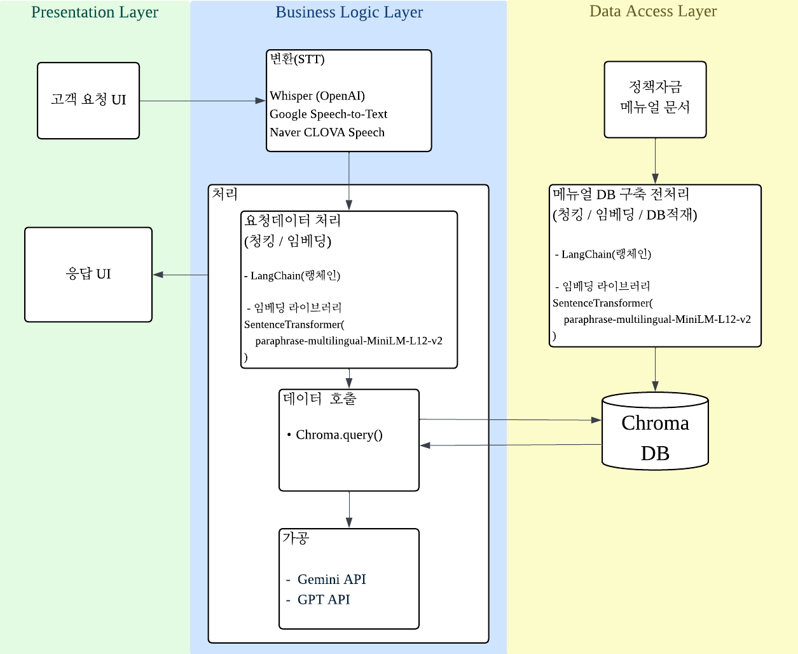
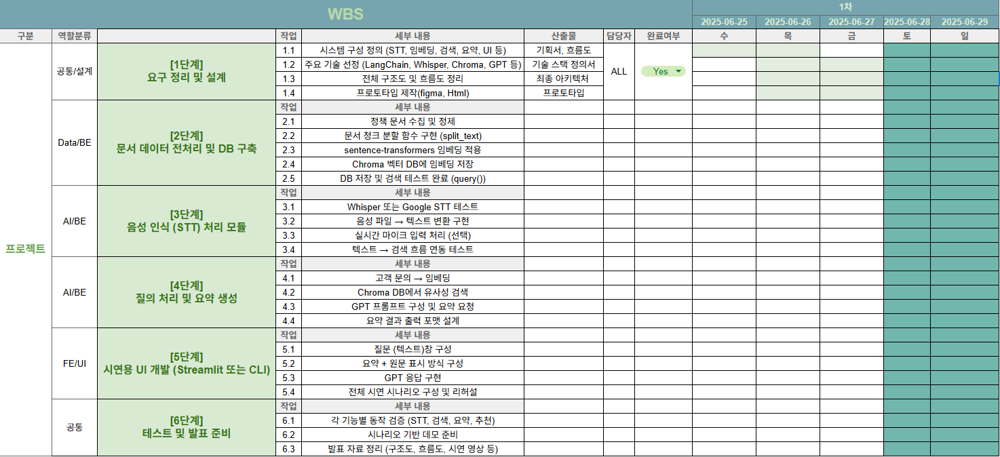

# 🐱‍💻💬 wh07-1st-Tooktook
**실시간 정책자금 AI 상담 지원**
LG U+ Why Not SW Camp 7기 툭툭 레포지토리 입니다.

  
  
   
  <em style="font-size: 13px; color: gray;">※ 이 이미지는 GPT로 생성된 캐릭터입니다</em>

<h2>👥 팀원 소개</h2>

  <table>
    <tr>
      <th>이정석</th>
      <th>박상준</th>
      <th>한지훈</th>
      <th>홍가연</th>
    </tr>
    <tr>
      <td></td>
      <td></td>
      <td></td>
      <td></td>
    </tr>
    <tr>
      <td align="center"></td>
      <td align="center"></td>
      <td align="center"></td>
      <td align="center"></td>
    </tr>
  </table>

--- 
# 📃프로젝트 기획서

프로젝트 기획안

<a href="툭툭 기획서 PPT.pdf" target="_blank">기획안 (PDF)</a>
  
  
---

시스템 구조 및 기술 선택 배경

<a href="툭툭 시스템 구조 및 기술 선택 배경.pdf" target="_blank">시스템 구조 및 기술 선택 배경 (PDF)</a>
  
  
이 문서에는 다음 내용이 포함되어 있습니다:   
  
- 시스템 처리 흐름
- RAG vs Fine-tuning 선택 배경

---

프로토타입

> 📦 **[툭툭 프로토타입 보러가기](https://sjun4040.github.io/prototype/)**  
> 시스템이 실제로 어떻게 작동하는지 직접 확인해보세요!

## 툭툭(Tooktook) 프로젝트 요구사항 정의서

## 1차 프로젝트 개요
### 툭툭(Tooktook)

툭툭은 상담사의 업무를 돕는 **AI 기반 상담 지원 시스템**입니다.   
복잡하고 반복적인 고객 문의 속에서 상담사가 더 빠르고 정확하게 대응할 수 있도록 툭툭이 옆에서 똑똑하게 도와줍니다.

❔ 왜 만들었을까요?
많은 상담사분들이 이런 고민을 가지고 있습니다:

> “비슷한 질문이 계속 반복되는데, 답변을 찾는 데 시간이 너무 오래 걸려요.”   
> “상담이 밀릴수록 고객은 화나고, 나는 더 급해져요.”   
> “지금 상황에서 무슨 정보를 먼저 보여줘야 할지 모르겠어요.”   

**툭툭은 이런 문제를 해결하기 위해 태어났습니다.**
- 사람이 직접 모든 정보를 찾고 정리하지 않아도
- 툭툭이 실시간으로 관련 자료를 추천하고
- 음성 상담 내용을 자동으로 정리하며
- 매뉴얼을 기반으로 대응 방식까지 제안합니다.

**툭툭은 AI지만 주인공은 사람입니다**
**툭툭은 상담사를 대체하는 시스템이 아닙니다.**
> 사람이 중심이고 AI는 조력자입니다.   
> 툭툭은 상담사가 더 전문적인 판단과 따뜻한 응대를 할 수 있도록
> 뒤에서 조용히 보조하는 도우미입니다.

---

## 📋 시스템 요약
| 항목     | 내용                                                           |
| ------ | ------------------------------------------------------------ |
| 프로젝트명  | 툭툭 (Tooktook)                                                |
| 목적     | 실시간 음성 인식과 AI 추천을 통해 상담사의 대응 효율성과 정확성을 높이는 웹 기반 상담 지원 시스템 개발 |
| 대상 사용자 | 상담사                                                       |
| 시스템 범위 | 음성 입력 → 실시간 텍스트 표시 → 메뉴얼 기반 응답 추천 → 상담 요약 저장              |

### 시스템 흐름도

### 시스템 아키텍쳐

---

## 기능 요구사항
| ID   | 기능명      | 설명                   | 우선순위 |
| ---- | -------- | -------------------- | ---- |
| F-01 | STT 변환   | 수신된 음성을 실시간 텍스트로 변환  | 중    |
| F-02 | 텍스트 표시   | 변환된 텍스트를 화면에 실시간 출력  | 상    |
| F-03 | 키워드 추출   | 발화에서 주요 키워드를 추출      | 상    |
| F-04 | 응답 추천    | 키워드 기반으로 문서/응답을 추천   | 상    |
| F-05 | 검색    |  상담사가 원할 때 메뉴얼 검색 | 중  |
| F-06 | 상담 요약    | 흐름을 요약한 자동 요약 생성  | 중    |
| F-07 | 상담 저장    | 전체 상담 내용 및 요약을 저장    | 상    |

## 비기능 요구사항
| 항목   | 요구사항                         |
| ---- | ---------------------------- |
| 실시간성 | 발화 후 3초 이내로 텍스트 및 추천 응답 제공   |
| 정확성  | 키워드 추출 및 추천 응답 정확도 80% 이상    |
| 보안   | 저장된 상담 내용은 암호화 저장 필요         |
| 확장성  | 향후 챗봇 연동 또는 FAQ 자동화 가능 구조 고려 |

--- 

## 🎬 툭툭 사용 시나리오

**⏱ 흐름**

- 상담사는 툭툭 시스템 웹 화면을 열고 상담 시작 버튼을 클릭
- 전화 연결
- 툭툭은 음성을 실시간으로 텍스트로 변환
- 텍스트 내 주요 키워드(ex. 요금, 이자, 대출) 추출
- 해당 키워드에 매칭된 응답 문구나 문서를 추천
- 상담사는 추천된 응답을 고객에게 전달
- 상담이 끝나면 자동 요약이 생성되고 저장됨

## WBS

---

## 사용 기술

### 💻 Languages

### 📚 Libraries & Frameworks

 

### 📦 Database

